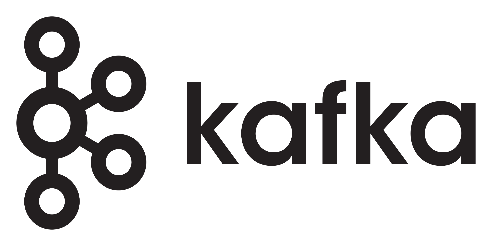

<h1 align="center">
  <br>
  
  <br>
  Kafka Web Gateway
  <br>
</h1>

<h4 align="center">A scalable intermediary server to connect Browser clients to Apache Kafka</h4>

<p align="center">
  <a href="../../graphs/contributors">
    
  </a>
  <a href="../../stargazers">
     
  </a>
  <a href="../../issues">
     
  </a>
  <a href="../../pulls">
     
  </a>
  <a href="../../commits/master">
     
  </a>
</p>

<p align="center">
  <a href="#documentation">Documentation</a> •
  <a href="#deployment">Deployment</a> •
  <a href="#authors">Authors</a>
</p>

Kafka uses a binary protocol over TCP. A web browser cannot natively establish a TCP connection with a Kafka Cluster which leads to the need of a protocol translation intermediary infrastructure. This intermediary takes advantage of the official Kafka Client APIs to interact with the Kafka cluster and expose a WebSocket protocol oriented API to establish bidirectional message based communication with the web browsers. This procedure will allow any other platform supporting WebSockets to establish a connection with the mentioned intermediary infrastructure.

To address this limitation, the intermediary infrastructure solution provides the ability of associating a number of client browsers to a much reduced number of Kafka Clients.
With this approach, the web browser uses a library with the capability of communicating with the exposed intermediary infrastructure’s WebSocket API. 
Associated with the scalling limitation issue, since one of the goals of this project is to allow a high number of web clients to access Kafka then some strategy needs to me applied in order to supply each web client with only the information they seek.
For example: If a Battleship application with thousands of players and thousands of matches is using this solution then a strategy to represent a game in Kafka needs to be created since a topic cannot represent a game due to the low topic limit for this sort of scale (4000 topics if each topic possesses a partition only).

The solution provides the option for the web clients to specify the keys from each topic that they seek to consume, while the intermediary infrastructure subscribes to the whole topics in Kafka. In the mentioned example a key could be used in each record to distinguish what information each web client will consume.

---

## Documentation

A final report of the project is available at [here](https://github.com/i-on-project/kafka-web-gateway/blob/main/docs/report.pdf).

Workspace projects:
* **chatroom-backend**: A demonstration project of a Spring Chatroom server responsible for providing chatroom-frontend Web Browser Clients chat rooms to communicate with.
* **chatroom-frontend**: A demonstration project of a Next JS React SPA that allows Web Clients to communicate with the Kafka Web Gateway application to consume and publish from Kafka using the chatroom-backend as the business and authentication server.
* **gateway-hub**: The platform responsible for exposing the WebSocket API for Web Browser clients to consume information from Kafka. Also, an HTTP API for authorization access control and admin configuration access.
* **kafka-demo**: A project used to acquire Kafka APIs know how with some utils classes and tests;
* **record-router**: A Kafka streams application responsible for feeding the Web Browser Clients subscribed data to the Gateway Hub;

**PS:** This is a Proof Of Concept project that needs further investigation and implementation to become business ready.

### HTTP API
An OpenAPI documentation of the exposed HTTP API is described [here](https://github.com/i-on-project/kafka-web-gateway/blob/main/docs/http-api.yaml).


### WebSocket API

The WebSocket API is the primary interface for clients to communicate with the Kafka WebSocket Gateway.

Clients send commands as JSON payloads over the WebSocket connection. The Gateway Hub processes the commands exactly as it was sent, partial messages are not supported, and sends back appropriate responses, ack or error messages indicating their success, or client messages data to be consumed from subscriptions.

All commands will be encapsulated in these objects: 

```
open class Command(val type: String)

data class ClientMessage(
    var messageId: String?,
    val command: Command
)
```

The **messageId** is currently used for two scenarios:

* To validate the success or failure of an operation, for example, when a publish command is sent with a _messageId_ from the client to the server, the server will respond either an Ack or Err message representing the success or not of the operation, with the same _messageId_.
* For the server to acknowledge a record sent to the client, in this case, the client must send an Ack message if it consumed/received the record, otherwise retries can happen if such functionality is enabled. 

The WebSocket API supports the following commands:

* **Subscribe**: The subscribe command allows clients to subscribe to one or more topics and receive messages from them. Clients can specify the topics they want to subscribe to along with optional keys for topic partitioning. The gateway validates the client's permissions before subscribing to the topics.

```
data class Subscribe(val topics: List<TopicType>): Command("subscribe")
```

This is the message that is sent from the Gateway to the client from subscribed topics. 
```
data class Message(
    val topic: String,
    val partition: Int,
    val key: String?,
    val value: String,
    val timestamp: Long,
    val offset: Long
) : Command("message")
```

* **Consume**: The consume command is used by clients to consume messages from subscribed topics. This command is typically used to retrieve historical messages. Not currently supported in this architecture, further analysis is needed to implement such.

```
data class Consume(val maxQuantity: Int?) : Command("consume")
```

* **Publish**: The publish command allows clients to publish messages to a specific topic. Clients can provide the topic name, optional key for partitioning, and the message payload. The gateway validates the client's permissions before allowing the message to be published.

```
data class Publish(
    val topic: String,
    val key: String?,
    val value: String
) : Command("publish")
```

* **Pause**: The pause command is used to pause the consumption of messages from subscribed topics. Clients can send this command to temporarily stop receiving messages.

```
data class Pause(val topics: List<TopicType>) : Command("pause")
```

* **Resume**: The resume command is used to resume the consumption of messages from paused topics. Clients can send this command to resume receiving messages after pausing.

```
data class Resume(val topics: List<TopicType>) : Command("resume")
```

These commands are used internally, they should not be sent directly by a client:

* **Ack**: The ack command is used by clients to acknowledge the successful processing of a message. Clients can send an acknowledgement for a received message, indicating that it has been successfully processed. The gateway uses acknowledgements to track message delivery status.

```
data class Ack : Command("ack")
```

* **Error**: The error command is sent by the gateway to notify clients about any errors or failures that occur during message processing or command handling.

```
data class Err(val message: String?) : Command("error")
```

The util _TopicType_ object is defined as the following:
```
data class TopicType(val topic: String, val key: String?)
```

### Browser Library

The appendix A is a TypeScript implementation of a web client library for interacting with the Kafka WebSocket Gateway. Typescript is transpiled to Javascript to be able to run on Browsers . This library allows clients to connect to the gateway, subscribe to topics, publish messages, and receive real-time updates. \par

The GatewayClient class represents the main entry point of the library. Here's an explanation of its components and methods:

**Constructor:** Initializes the client with the URL of the Kafka WebSocket Gateway. Set up various properties such as the WebSocket connection, subscriptions, operation callbacks, and status flags.

**Connect:** Establish a WebSocket connection to the gateway using the provided authentication token. It sets up the necessary event listeners for handling open, message, and close events. When the connection is successfully established, the optional onOpenCallback is invoked.

**Disconnect:** Closes the WebSocket connection and performs necessary clean-up such as clearing subscriptions and logging the disconnection.

**onOpen:** Registers a callback function to be executed when the WebSocket connection is opened successfully.

**onClose:** Registers a callback function to be executed when the WebSocket connection is closed.

**Subscribe:** Subscribes to a topic with an optional key and registers a message callback function. Send a subscribe command to the server and returns a promise that resolves when the subscription is acknowledged or rejects if an error occurs.

**Publish:** Publishes a message to a topic with an optional key. Send a publish command to the server and returns a promise that resolves when the publication is acknowledged or rejects if an error occurs.

---

## Deployment

A ready to deploy containerized environment is available through the script 'runProject.bat' script.

It consists of the following containers:
* PostgreSQL Database
* 2 Gateway Hub Nodes
* 2 Record Router Nodes
* 3 Apache Kafka Brokers/Nodes
* 3 ZooKeeper's Servers
* Nginx
  
---

## Developers

* [Alexandre Silva](https://github.com/Cors00)
* [Miguel Marques](https://github.com/mjbmarques)

### Supervisors

* [Pedro Félix](https://github.com/pmhsfelix) [ISEL]
